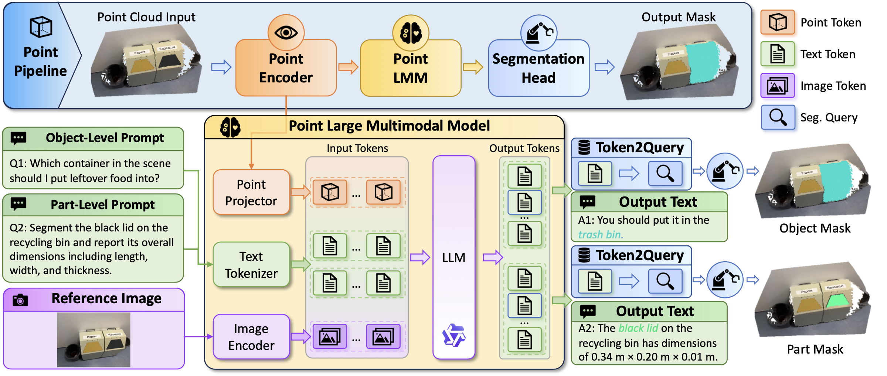

<div align="center">


# Ground3D-LMM: Fine-Grained 3D Point Grounding<br>and Spatial Reasoning with LMM

[](https://arxiv.org/abs/2607.05493)
[](https://amolharsh.github.io/ground3d-lmm/)
[](https://amolharsh.github.io/ground3d-lmm/)
[](https://huggingface.co/datasets/amolharsh/Ground3D_Dataset)
[](LICENSE)
[](https://pytorch.org/)

---

**Amol Harsh · Zongyan Han · Jean Lahoud · Ye Liu · Rao Muhammad Anwer · Hisham Cholakkal · Salman Khan · Fahad Shahbaz Khan**

**Ground3D-LMM** is a large multimodal model for **fine-grained 3D point grounding** and **spatial reasoning** in indoor scenes. It produces per-point segmentation masks alongside grounded natural-language answers across **8 sub-tasks** on ScanNet and ScanNet++, trained on a **2.47M Q/A pair** dataset.

</div>

---

The architecture combines:
- **SpConvUNet** sparse 3D point encoder (from UniSeg3D)
- **Qwen3-VL-4B** vision-language model with LoRA fine-tuning
- **Mask2Former-style query decoder** with 2000 learned queries
- **Superpoint pooling** for efficient cross-attention over scenes

## 📢 News

- **[Featured 📣]** *Ground3D-LMM* was featured by [52CV](https://mp.weixin.qq.com/s/ZH2NctV9Ycg8t4EVui7gIg), a leading Chinese computer-vision community WeChat account.
- **[Accepted 🎉]** *Ground3D-LMM: Fine-Grained 3D Point Grounding and Spatial Reasoning with LMM* accepted to **ECCV 2026** (main conference).
- **[Released]** Code and Ground3D dataset (2.47M Q/A pairs) released on Hugging Face.

## 🏗️ Architecture



A 3D scene (XYZ + RGB point cloud) is encoded by **SpConvUNet** into per-point features, which are then pooled over precomputed superpoints to yield `Fp ∈ ℝ^(M × d)`. `Fp` is projected into two spaces in parallel: (i) into the **Qwen3-VL LMM** as `<|point|>` token embeddings alongside the text prompt and optional RGB frame, and (ii) into the **mask decoder** as keys/values for 6 layers of Mask2Former-style Cross-Attn → Self-Attn → FFN. The LMM generates text that includes `<SEG>` tokens; the hidden state at each `<SEG>` becomes a refined query, which is dot-producted against per-point features to produce the final segmentation mask.

## 🚀 Install

```bash
conda create -n ground3d python=3.10 -y
conda activate ground3d
# Follow docs/INSTALL.md for the OpenMMLab stack + MinkowskiEngine (source builds),
# then install this package:
pip install -e .
```

> **Heads-up:** `conda env create -f environment.yml` does **not** fully work on its own —
> `mmcv==2.1.0` has no prebuilt wheel for torch 2.4.1 (needs a source build with an older
> `setuptools` + `--no-build-isolation`), and **MinkowskiEngine 0.5.4** must be compiled
> from source. Follow [docs/INSTALL.md](docs/INSTALL.md) **Option B** for the verified,
> step-by-step install, troubleshooting, and tested environment details.

**Tested**: Ubuntu 20.04 · Python 3.10 · PyTorch 2.4.1 · CUDA 11.8 · A100 80GB / RTX 3090.

## ⚡ Quick Start with HuggingFace

### Download the dataset
```python
from huggingface_hub import snapshot_download

# Annotations only (~3 GB) for exploration
data_root = snapshot_download(
    repo_id="amolharsh/Ground3D_Dataset",
    repo_type="dataset",
    allow_patterns=["*/refined_qa_data/*", "*/part_ground3d_*.txt", "README.md"],
)

# Full dataset (~150 GB) for training
# data_root = snapshot_download(repo_id="amolharsh/Ground3D_Dataset", repo_type="dataset")
```

### Download a pretrained checkpoint
```python
from huggingface_hub import snapshot_download

# Joint variant — uses 3D point cloud + aligned RGB frames (main paper result)
ckpt_dir = snapshot_download(repo_id="amolharsh/Ground3D-LMM-4B-Joint")

# Or the point-only variant — uses 3D points only (no RGB frames needed)
# ckpt_dir = snapshot_download(repo_id="amolharsh/Ground3D-LMM-4B-3D")
```

### Run inference (single config-driven invocation)

Each released checkpoint has a matching eval config — the Joint (3D + 2D) variant uses
`ground3dlmm_eval_ground3d_scannet.py` (LoRA r=16, RGB frames on), and the 3D-only variant
uses `ground3dlmm_eval_ground3d_scannet_3d.py` (LoRA r=32, no RGB frames). The `_3d` config
inherits from the joint one and only overrides those three fields.

```bash
# --- Joint (3D + 2D) — main paper result ---
CKPT="$(huggingface-cli download amolharsh/Ground3D-LMM-4B-Joint --quiet)/pytorch_model.pth"
CONFIG=configs/ground3dlmm_eval_ground3d_scannet.py

# --- Or, 3D-only ---
# CKPT="$(huggingface-cli download amolharsh/Ground3D-LMM-4B-3D --quiet)/pytorch_model.pth"
# CONFIG=configs/ground3dlmm_eval_ground3d_scannet_3d.py

PYTHONPATH=. python tools/test.py \
    "$CONFIG" "$CKPT" \
    --work-dir work_dirs/quickstart \
    --cfg-options \
        "model.decoder.save_pred_qa_dir=work_dirs/quickstart/preds" \
        "test_dataloader.dataset.pipeline.2.transforms.2.task_level=part_qa_data" \
        "test_dataloader.dataset.pipeline.2.transforms.2.task_type=qa_data" \
        "test_dataloader.dataset.pipeline.2.transforms.2.sub_task=scale_estimation"
```

This runs inference for the `scale_estimation` sub-task on `part_qa_data` and writes:
- Per-scene predictions to `work_dirs/quickstart/preds/{scene}.json`
- Segmentation mIoU to stdout

> For batched evaluation across sub-tasks or both datasets, `bash eval_ground3d.sh` auto-detects
> the variant from the checkpoint's LoRA rank and picks the matching config — see the
> [Evaluation](#-evaluation) section.

## 📊 Ground3D Dataset

Total **2,475,307 Q/A pairs** spanning 8 sub-tasks across ScanNet and ScanNet++ scenes.

| Source | Train scenes | Val scenes | Object QA | Part QA | Multi-turn | Total |
|---|---:|---:|---:|---:|---:|---:|
| ScanNet      | 1,433 |  80 | 655,760 |   909,905 | 62,064 | 1,627,729 |
| ScanNet++    |   857 |  48 | 339,396 |   498,399 |  9,783 |   847,578 |
| **Total**    | **2,290** | **128** | **995,156** | **1,408,304** | **71,847** | **2,475,307** |

> Not every ScanNet++ scene could be used: many scenes in the ScanNet++ release are missing the depth
> or mesh files our pipeline needs, and a few lost their Q/A during our VLM-based verification stage.
> The scene count here may therefore differ slightly from the paper, since some scenes were listed but
> held no Q/A and have been removed. **The total number of Q/A pairs is unchanged and matches the paper.**

### Sub-tasks
1. `functional_part_grounding`
2. `functional_object_grounding`
3. `scale_estimation`
4. `grounded_dimension_reasoning`
5. `relative_depth_forward`
6. `existence_verification`
7. `scale_comparison_size`
8. `distance_estimation`
9. `relative_position_forward_reasoning`

Full dataset schema, Q/A JSON layout, and per-file specifications: see the [dataset card on Hugging Face](https://huggingface.co/datasets/amolharsh/Ground3D_Dataset).

### Prepare the data (download → convert)

**Step 1 — download** from Hugging Face. Each source (`scannet`, `scannetpp`) ships
the raw per-frame arrays plus QA JSON and split lists:

```
data/scannet/
├── processed_data/<scene>/frame_<n>_vert.npy         # XYZ+RGB points (load_dim=6)
│                          frame_<n>_sp_label.npy      # superpoint ids
│                          frame_<n>_part_label.npy    # per-point part labels
│                          frame_<n>_object_label.npy  # per-point object labels
├── refined_qa_data/{part_qa,object_qa,multiturn_qa}/<scene>/...
└── part_ground3d_{train,val}.txt                      # scene split lists
```

**Step 2 — convert** the raw `.npy` into the flat `.bin` files and the `infos.pkl`
the configs actually consume:

```bash
python tools/create_data.py --dataset part3d_glamm \
    --root-path   data/scannet \
    --out-dir     data/scannet \
    --qa_data_dir data/scannet/refined_qa_data
```

**ScanNet++** uses the identical layout — just swap the paths (the converter is dataset-agnostic;
the ScanNet++ config reuses `data/scannet/scannet_cls_embedding.pth`):

```bash
python tools/create_data.py --dataset part3d_glamm \
    --root-path   data/scannetpp \
    --out-dir     data/scannetpp \
    --qa_data_dir data/scannetpp/refined_qa_data
```

Resulting layout (what the configs load via `ann_file` + `data_prefix`):

```
data/scannet/
├── points/  super_points/  part_mask/  object_mask/   (<scene>_frame_<n>.bin)
├── part3d_glamm_infos_train.pkl
├── part3d_glamm_infos_val.pkl
└── scannet_cls_embedding.pth                           (shipped in this repo)
```

> **Joint model only:** the config's `model.decoder.image_dir` expects RGB frames at
> `data/scannet/frame_images/<scene>/<frame>.jpg`. These are ScanNet / ScanNet++ images and are
> **not redistributable** (so they are not on Hugging Face). Download the raw datasets and extract
> the frames each split needs by following **[docs/DATA_IMAGES.md](docs/DATA_IMAGES.md)**
> (`tools/build_frame_images.py` does it straight from the `.pkl`). Or use the **3D-only**
> checkpoint, which needs no images (`model.decoder.image_dir=None`).

## 🤗 Model Zoo

| Model | Modality | LoRA (r / α) | Eval config | Checkpoint |
|---|---|---|---|---|
| Ground3D-LMM-4B (Joint) | 3D points + RGB frames | 16 / 32 | `configs/ground3dlmm_eval_ground3d_{scannet,scannetpp}.py` | [🤗 Ground3D-LMM-4B-Joint](https://huggingface.co/amolharsh/Ground3D-LMM-4B-Joint) — main paper result |
| Ground3D-LMM-4B (3D-only) | 3D points only | 32 / 64 | `configs/ground3dlmm_eval_ground3d_{scannet,scannetpp}_3d.py` | [🤗 Ground3D-LMM-4B-3D](https://huggingface.co/amolharsh/Ground3D-LMM-4B-3D) — no RGB frames required |

Both checkpoints use **Qwen3-VL-4B** as the LLM backbone (4.47B params, ~400M LoRA-trainable).
The two variants have different LoRA ranks, so each ships with its own eval config; the config
inheritance keeps the diff between them tiny (`lora_r`, `lora_alpha`, `image_dir`). If you're
running through `eval_ground3d.sh`, the launcher probes the checkpoint's LoRA rank and picks
the matching config automatically — no manual switch needed.

## 🏋️ Training

### Prepare data
1. Download the dataset and arrange under `data/scannet/` and `data/scannetpp/` (see [Local data layout](#local-data-layout))
2. Download pretrained sparse-conv weights into `work_dirs/pretrained/`:
   - `sstnet_scannet.pth` — used as the point-encoder initialization
3. The Qwen3-VL-4B base model will be downloaded automatically by `transformers`. To use a local copy, override via `--cfg-options model.decoder.qwen_model_path=/path/to/Qwen3-VL-4B-Instruct`

### Launch training (4 GPUs, LoRA fine-tuning)
```bash
bash train.sh
```

This launches `configs/ground3dlmm_train.py` on GPUs 0-3 via `torch.distributed.launch`. Checkpoints are saved to `work_dirs/ground3dlmm/epoch_*.pth`.

### Customize the training run
Common arguments to edit in `configs/ground3dlmm_train.py`:

| Field | Default | Purpose |
|---|---|---|
| `model.decoder.qwen_model_path` | `Qwen/Qwen3-VL-4B-Instruct` | Path or HF id of the LLM |
| `model.decoder.lora_r`, `lora_alpha` | 16, 32 | LoRA rank and scaling |
| `model.decoder.max_point_tokens` | 2000 | Max superpoint tokens fed to LLM |
| `train_dataloader.batch_size` | 1 | Per-GPU batch size |
| `optim_wrapper.optimizer.lr` | 1e-4 | Base learning rate |
| `epoch` | 10 | Total training epochs |
| `load_from` | `work_dirs/pretrained/sstnet_scannet.pth` | Backbone init |

## 📈 Evaluation

The paper reports **three categories of metrics**. Full evaluation is a 3-step pipeline:

### Step 1 — Run inference (segmentation mIoU + per-scene predictions)

One launcher, fully argument-driven — pick the dataset / task levels / sub-tasks with flags:
```bash
bash eval_ground3d.sh --checkpoint work_dirs/ground3dlmm/pytorch_model.pth   # default: scannet, part+object, all sub-tasks

# choose exactly what to run:
bash eval_ground3d.sh --dataset all      --levels all                                   # both datasets, part+object+multi_turn
bash eval_ground3d.sh --dataset scannet  --levels part,object --sub_tasks distance_estimation,scale_estimation
bash eval_ground3d.sh --dataset scannetpp --levels multi_turn
bash eval_ground3d.sh --help             # full option list (+ --gpus, --out-root, --mask-dump)
```
`--dataset` = `scannet`|`scannetpp`|`all`; `--levels` = any of `part,object,multi_turn` (or `all`);
`--sub_tasks` = `all` or a comma list. `--variant` = `joint`|`3d`|`auto` (default `auto`): the launcher
inspects the checkpoint's LoRA rank (`r=16` → joint, `r=32` → 3D-only) and picks the matching config,
so the Joint and 3D-only weights just work with the same command. Pass `--variant` explicitly to
override. The old names `eval_ground3d_{scannet,scannetpp,all}.sh` still work — they're thin wrappers
that pass flags through. Outputs:
- **Segmentation mIoU** (printed per sub-task)
- Per-scene prediction JSONs in `val_outputs_joint/{scannet,scannetpp}/pred_qa_data_val/...`

> Add `--mask-dump <dir>` to also dump per-QA masks (needed for the **GM-δ** stage below, and used by
> the grounding visualization).

`tools/evaluate_text_metrics.py` runs **two independent stages** — pick what you need via `--stages`
(`ape`, `judge`, or `all`). The `--input` dir is searched **recursively**, nested / multi-turn
prediction JSONs are flattened automatically, and each sample is tagged with its task. `ape` uses a
text LLM (`--llm_model_path`, default `Qwen/Qwen3-4B-Instruct-2507`) to extract numbers; `judge` uses
the paper's VL judge (`--judge_model_path`, default `Qwen/Qwen3-VL-4B-Instruct`). Both run via
**HuggingFace transformers**. Sanity-check the numeric math with
`python tools/evaluate_text_metrics.py --selftest`.

### Step 2 — `ape` : numeric APE + δ@1.25 (the 4 numeric tasks only)
```bash
python tools/evaluate_text_metrics.py --input val_outputs_joint/scannet/pred_qa_data_val \
    --output eval_results/scannet_ape.json --stages ape \
    --llm_model_path Qwen/Qwen3-4B-Instruct-2507 --gpus 0,1,2,3
```
Runs **only** on `distance_estimation`, `grounded_dimension_reasoning`, `scale_estimation`,
`scale_comparison_size`. The LLM extracts the scalar(s) in metres (per-task JSON shape; a missing
prediction → `0.0` so it is penalised), then reports **APE** `|ŝ−s|/s×100%` and **δ@1.25** success
(`δ = max(ŝ/s, s/ŝ) ≤ 1.25`; GT==0 pairs skipped; mean over pairs, then macro-averaged per task).

### Step 3 — `judge` : LLM judge — Hallucination + Completeness (all tasks)
```bash
python tools/evaluate_text_metrics.py --input val_outputs_joint/scannet/pred_qa_data_val \
    --output eval_results/scannet_judge.json --stages judge \
    --judge_model_path Qwen/Qwen3-VL-4B-Instruct --gpus 0,1,2,3
```
The Table-4 judge — **Qwen3-VL-4B-Instruct** — scores each prediction and reports **Hallucination**
and **Completeness** (over all tasks). Run both stages with `--stages all` (the `ape` extractor
stays on the text `Qwen3-4B-Instruct-2507`).

### Step 3b — `gmdelta` : GM-δ (supplementary, opt-in)
GM-δ (Grounded-Measurement) counts a prediction correct only when **mask IoU > 0.3 AND δ ≤ 1.25**, on
the numeric tasks that also ground. Run the numeric sub-tasks **with `--mask-dump`** (the mask tree
mirrors the prediction tree), then **one command auto-iterates all 4 numeric tasks × both datasets**:
```bash
# 1. inference for the 4 numeric tasks on both datasets, dumping per-QA masks
bash eval_ground3d.sh --dataset all --levels part \
    --sub_tasks distance_estimation,grounded_dimension_reasoning,scale_estimation,scale_comparison_size \
    --mask-dump masks --checkpoint work_dirs/ground3dlmm/pytorch_model.pth

# 2. GM-δ across all of them in a single run
python tools/evaluate_text_metrics.py --stages gmdelta \
    --input val_outputs_joint --mask_dump_dir masks \
    --llm_model_path Qwen/Qwen3-4B-Instruct-2507 --gpus 0,1,2,3 --output eval_results/gmdelta.json
```
It reports GM-δ **per (dataset, task)** and **overall**. `--gmdelta_task all` (default) auto-discovers
the numeric tasks; pass a single task name to restrict.

### Metric provenance (the paper's metrics)

| Metric | Provided by | Tasks |
|---|---|---|
| Segmentation mIoU | `tools/test.py` → `Part3DGlamm_SegMetric` | all sub-tasks (over each QA's `<SEG>` grounding) |
| APE & δ@1.25 (LLM-extracted) | `evaluate_text_metrics.py --stages ape` | 4 numeric tasks |
| Hallucination + Completeness (LLM judge) | `evaluate_text_metrics.py --stages judge` | all tasks |
| GM-δ (IoU>0.3 ∧ δ≤1.25), *supplementary* | `evaluate_text_metrics.py --stages gmdelta` | grounded-measurement |

> mIoU is computed per `(level, sub-task)` over the QAs that emit a `<SEG>` grounding. Every sub-task
> grounds, so all of them get a mIoU — the only partial case is `existence_verification`, where the
> pure yes/no answers carry no mask and are simply excluded from its mIoU.

## 🔁 ScanRefer & Reason3D (Tables 5–6)

Ground3D-LMM is also fine-tuned + evaluated on the ScanRefer and Reason3D referring/reasoning
benchmarks, in both **3D** and **3D+2D** (point cloud + the scene's 20 RGB views) settings:

| Row | Config | Checkpoint | mIoU |
|---|---|---|---|
| ScanRefer 3D | `configs/ground3dlmm_eval_scanrefer.py` | `Ground3D-LMM-ScanRefer-4B-3D` | 38.72 |
| ScanRefer 3D+2D | `configs/ground3dlmm_eval_scanrefer_image.py` | `Ground3D-LMM-ScanRefer-4B-Joint` | 41.30 |
| Reason3D 3D | `configs/ground3dlmm_eval_reason3d.py` | `Ground3D-LMM-Reason3D-4B-3D` | 36.35 |
| Reason3D 3D+2D | `configs/ground3dlmm_eval_reason3d_image.py` | `Ground3D-LMM-Reason3D-4B-Joint` | 41.29 |

Data prep (annotations → `*_infos.pkl` via `tools/create_data_{scanrefer,reason3d}.py`, and the
20-view images via `tools/build_scene_images.py`) and the eval commands are in
**[docs/DATA_SCANREFER_REASON3D.md](docs/DATA_SCANREFER_REASON3D.md)**.

## 🎨 Grounding visualization

Color the model's predicted `<SEG>` masks on the scene point cloud and save a `.ply`
(1 `<SEG>` → red, 2 → red + green, N → palette). Two steps:

```bash
# 1. dump predicted masks during inference (toggle on, via config or env)
PYTHONPATH=. python tools/test.py configs/ground3dlmm_eval_ground3d_scannet.py "$CKPT" \
    --cfg-options model.decoder.save_viz_dir=viz_dumps  ...   # (or: MASK_DUMP_DIR=viz_dumps bash eval_ground3d_scannet.sh)

# 2. turn the dumps into colored point clouds (offline, no GPU/Open3D)
python tools/export_grounding_ply.py \
    --masks_dir viz_dumps --points_dir data/scannet/points --out viz_ply
```

`--mode combine` (default) writes one `.ply` per scene/conversation, coloring each grounded region
red, green, ...; `--mode per_qa` writes one red-masked `.ply` per question. Core writer:
`uniseg3d/grounding_viz.py`. For multi-turn dialogues (`task_level=multi_turn_qa_data`) each grounding
turn contributes one region, so a cross-object conversation produces one red object and one green
object in a single `.ply`.

## 🛠️ Repository structure

```
Ground3D-LMM/
├── configs/
│   ├── ground3dlmm_train.py
│   ├── ground3dlmm_eval_ground3d_scannet.py
│   └── ground3dlmm_eval_ground3d_scannetpp.py
├── data/                                  (user-populated; see Local data layout)
├── docs/
│   └── INSTALL.md
├── tools/
│   ├── train.py, test.py
│   ├── dist_train.sh, dist_test.sh
│   ├── create_data.py
│   └── evaluate_text_metrics.py
├── uniseg3d/                              (model + transforms + criteria)
│   ├── uniseg3d.py                        Grounded_LMM_main (entry point)
│   ├── query_decoder.py                   Grounded_Decoder_Joint / _Eval
│   ├── spconv_unet.py                     point encoder
│   ├── point_qwen3_vl.py                  Qwen3-VL with point-embedding injection
│   ├── transforms_3d.py                   QA_Generation_v2 / _Test
│   ├── unified_metric.py                  Part3DGlamm_SegMetric
│   └── ...
├── work_dirs/                             (checkpoints + logs, gitignored)
├── train.sh                               one-line training launcher
├── eval_ground3d_scannet.sh               eval on ScanNet
├── eval_ground3d_scannetpp.sh             eval on ScanNet++
├── eval_ground3d_all.sh                   eval on both
├── environment.yml                        conda spec (pinned versions)
├── pyproject.toml
└── LICENSE                                Apache-2.0
```

## 🙏 Acknowledgments

This codebase builds upon several open-source projects:

- **[UniSeg3D](https://github.com/dk-liang/UniSeg3D)** — sparse 3D point encoder + Mask2Former-style decoder
- **[Qwen3-VL](https://github.com/QwenLM/Qwen3-VL)** — vision-language model backbone
- **[mmdetection3d](https://github.com/open-mmlab/mmdetection3d)** — 3D data pipeline and registry framework
- **[Mask2Former](https://github.com/facebookresearch/Mask2Former)** — masked-attention decoder design

## 📚 Citation

If you find Ground3D-LMM useful for your research, please cite:

```bibtex
@inproceedings{ground3dlmm2026,
  title         = {Ground3D-LMM: Fine-Grained 3D Point Grounding
                   and Spatial Reasoning with LMM},
  author        = {Harsh, Amol and Han, Zongyan and Lahoud, Jean
                   and Liu, Ye and Anwer, Rao Muhammad
                   and Cholakkal, Hisham and Khan, Salman
                   and Khan, Fahad Shahbaz},
  booktitle     = {Proceedings of the European Conference on Computer Vision (ECCV)},
  year          = {2026},
  eprint        = {2607.05493},
  archivePrefix = {arXiv},
  primaryClass  = {cs.CV}
}
```

## 📄 License

Released under the [Apache 2.0 License](LICENSE).
